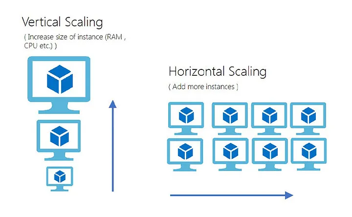

# Scaling - briefly explained in layman's terms

### What is Scaling? Why do we need it?

To understand Scaling let's see the difference between a scalable application and a non-scalable application 
during the festive months.

Assume this is the month of your favorite festival which is popular among the masses and which leads people 
to buy stuff. Now yours is a web platform that sells festive stuff and similarly, your friend has one too of 
his  own. The only difference is your web application is scalable and your friend's isn't. So when the sales 
are at their peak, your website is up and running while your friend's website is facing performance issues 
and people are not able to buy from your friend's website. 

So basically what scalability means is - your platform's ability to handle varying loads. It's not just a 
the sudden surge in users/traffic that a scalable app should handle but all sorts of situations.

### How do we make our application scalable?

There are majorly two ways to make your application scalable -
* Vertical Scaling 
* Horizontal Scaling

To know what happens in vertical scaling and horizontal scaling we should know that our application/platform 
is hosted on a server in a remote location. In layman's terms, we say that our platform is hosted on a cloud. 
A cloud is no different than your desktop. It's just that a cloud has largely enhanced computing power 
and other resources such as memory, processors, etc. 

So let's say you buy a server that has enough computing resources to host your platform from a service 
provider like AWS. You can make your platform scalable by adding more such servers to handle larger traffics 
or enhancing the capability of your server.

Buying more servers or having more servers is to refer to Horizontal Scaling and to enhance the capability of 
the server is to refer to Vertical Scaling.

### When do we use Vertical Scaling and when do we Horizontal Scaling?

Building and managing horizontal scaling architectures is generally more complicated. Nevertheless, it's the 
most popular choice for fast-growth applications since it's more resilient. If a server dies, another one can 
automatically step in and take its place. However, vertical scaling can be a suitable option for small and 
medium-sized companies as it's less complex and cheaper.

### Load Balancers - A term associated with Scaling

Load balancing is like having multiple waiters or servers at a restaurant to handle a large number of 
customers efficiently.
In the context of computer networks or web applications, load balancing works similarly. Instead of having a 
single server handle all incoming requests, multiple servers are used in a coordinated manner. When a user 
sends a request to a website, a load balancer acts as the "traffic cop" and routes the request to one of the 
available servers. This ensures that no single server gets overwhelmed with too many requests, and the 
workload is evenly distributed among all the servers.

### References 

* About scaling and deciding on whether to go for vertical or horizontal scaling - https://madappgang.com/blog/scalability-in-software-development/
* About knowing cloud concept and more on vertical and horizontal scaling - https://www.youtube.com/watch?v=xpDnVSmNFX0
* About load balancers - https://www.vmware.com/in/topics/glossary/content/software-load-balancing.html
* Tool used for better framing the words for better explanation - https://chat.openai.com/
